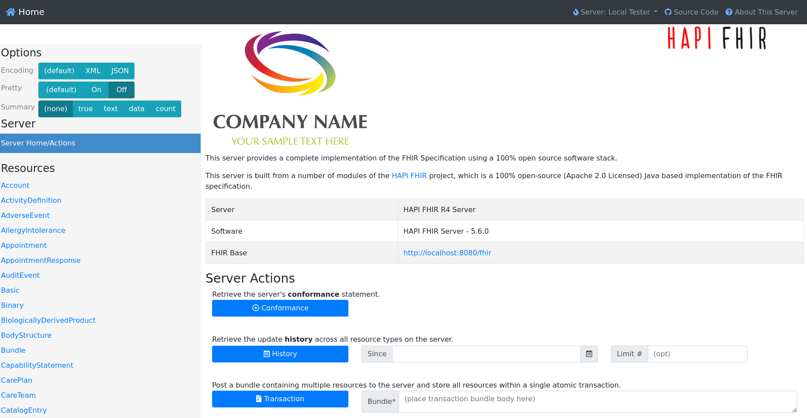
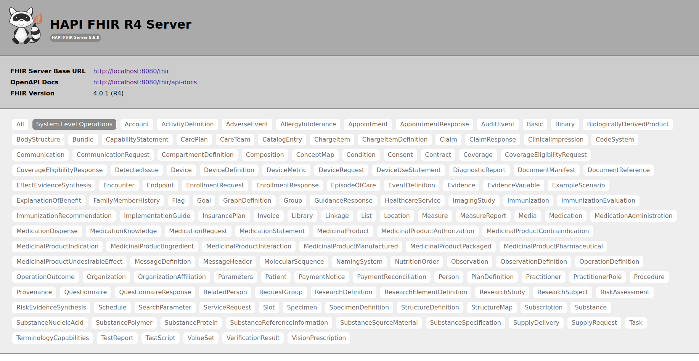
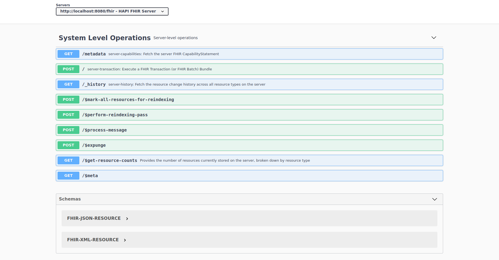
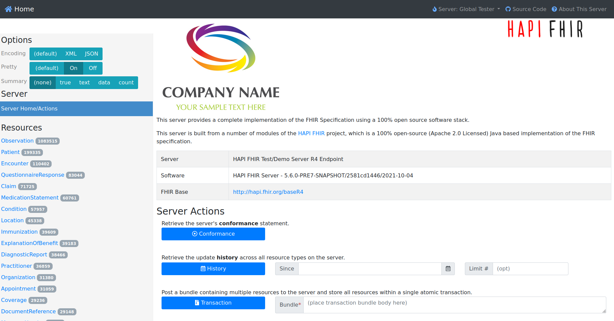

## HAPI FHIR Installation Instructions 

### Start HAPI-FHIR

Be patient this can take up to 5 minutes. The last message in the log should be something like this

`30-Nov-2021 14:58:16.207 INFO [main] org.apache.catalina.startup.Catalina.start Server startup in [30209] milliseconds`

### Start Screen

### Swagger UI for API

Follow the link FHIR BASE on the start page to get to the swagger UI. Alternativly you can just add `/fhir` to the URL of your HAPI-FHIR server. Here are all API calls presented. 

### Global FHIR test server

You can change to the global HAPI FHIR testing server on the top right:

## After the installation

Have a nice ride with the new Admins youngtimer.

