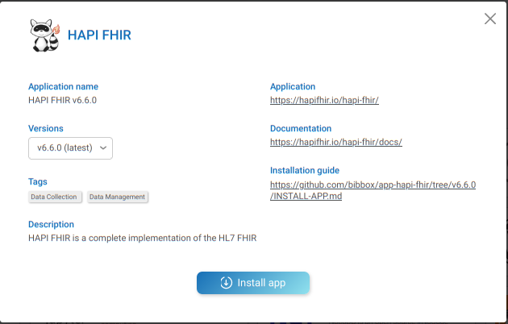
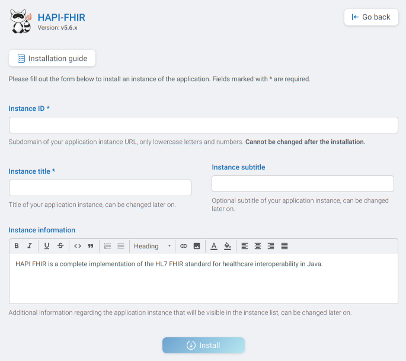

## HAPI FHIR Installation Instructions 

The application can be installed either within the BIBBOX environment or as a stand-alone solution. Installation instructions can be found within the BIBBOX, followed by setup instructions required once the application has been successfully installed.

## Installation within in the BIBBOX

Once you've selected the desired App for your BIBBOX instance, you can choose from the available versions, as shown in the following figure.

Clicking "Install App" will open a new window, as illustrated in the following figure. Here, you can define the necessary entries. Some fields come pre-filled with suggested options, and if left unchanged, these default values will be used as the entries.

After confirming by clicking "Install," the App will be installed as a BIBBOX instance. Once the installation is complete, you only need to follow a few steps to use the App for the first time, which are described below.

### Start HAPI-FHIR

Be patient this can take up to 5 minutes. The last message in the log should be something like this

`30-Nov-2021 14:58:16.207 INFO [main] org.apache.catalina.startup.Catalina.start Server startup in [30209] milliseconds`

### Start Screen

### Swagger UI for API

Follow the link FHIR BASE on the start page to get to the swagger UI. Alternativly you can just add `/fhir` to the URL of your HAPI-FHIR server. Here are all API calls presented. 

### Global FHIR test server

You can chnage to the global HAPI FHIR testing server on the top right:

## After the installation

Have a nice ride with the new Admins youngtimer.

